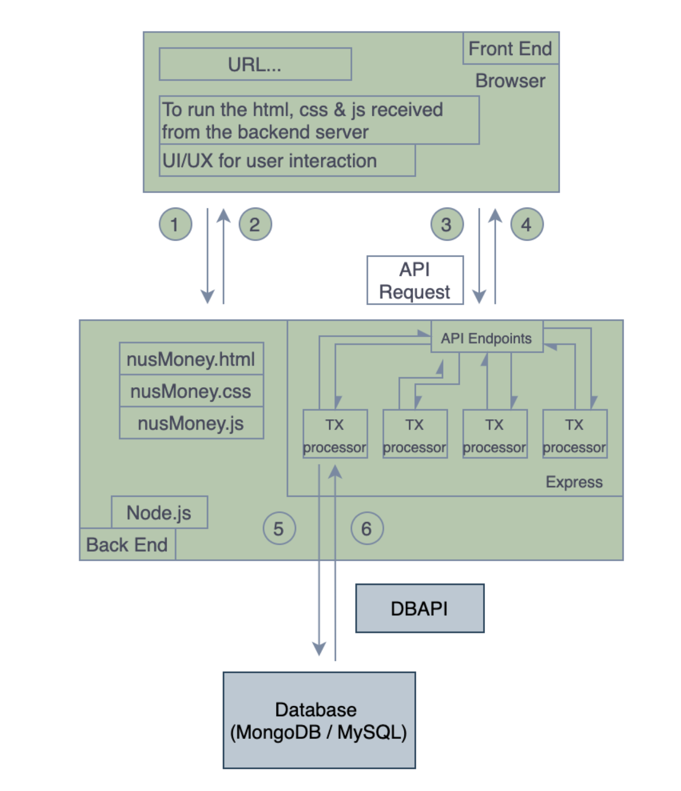

# Getting Started with Expat$

This project created for learning purpose to understand the fullstack development concept.
This project contains the details of how the Expat$ website for the NUS Fintech Programme was created.
It is a minimum viable prototype to demostrate the concept how the was built using the node.js & Express, API together with Auth0 for authentication.

The approaches of this application include:
- Using Auth0 for the user authentication.
- Build on the Node.js, Express, npm.
- A middle ware is implemented to check if the user is logged in. If the user is not logged in, the website will force user back to the login page. 
- API provided by the Banks is used to render the product information to the frontend. 
- Database to store user details.

For this simple full-stack development, we separate the repositories into:
~/Public to store the static files  
~/lib/middleware to keep the middleware
~/routes for the router
~/view for all the HTML

The Client-Server architecture shall includes:

### FrontEnd: 
	* To develop static web pages using HTML, CSS
	* To include the JavaScript codes to improve the website functionality. 
	* [Tentative] To include D3 for the data visualisation in the browser. 
	* [Tentative] Potentially using the ready JS framework, e.g.: reactJS or VUE (more smaller, lighter & simpler)
	* [Tentative] Potentially to have the mobile Apps (if time allows) 

Once we learnt about the HTML, CSS, and JavaScripts together with the ready-made JavaScript framework: Vue, ReactJS, AngularJS and etc, and running the site locally, we might begin to wonder how to deploy the application. That's why the Express sever hosted at Heroku cloud will be helpful here. However, due to the time constraint, we only deploy the server at the local without using Heroku cloud.

### Cloud: 
	* Nonetheless, here are the high-level steps to host a simple site on the Heroku Cloud:
		* Setting up the backend server using Node.js.
		* To setup the Heroku, Git, and npm.
		* To create an Express.js server. 
		* To create the static files (html/css/js describe the frontend) and to be stored at the backend server.
		* Deploy to the Heroku.
	* To build the API using Node.js and Express.
	* To build the SQL Databases, schemas and queries. 
	* To connect the Node.js to MySQL Databases.

Reference: 
		[How to deploy your app to the web using Express.js and Heroku](https://www.freecodecamp.org/news/how-to-deploy-your-site-using-express-and-heroku/)

### BankEnd:

#### Node.js
Node.js is the runtime environment based on the chrome V8 engine for executing the JavaScript at the server side. Similarly, the browser can be said as the runtime environment to execute the HTML, CSS or JS.  

Node.js is neither a programming language nor a framework.

Node.js is a platform used to build the backend services like API, web service, and allow the browser to acquire the data. Modules include:

| Modules | Description|
|   :----:    |    :----:    |
| HTTP | (server.js) For web service. E.g: var http = require("http"); |
| URL  | (router.js) For browser to send request and acquire the data from the backend. |
| QueryString | (requestHandle.js) To handle the parameters sent by the browser via the GET/POST, and to convert the parameters into JS objects. |
| FileSystem | To read the file on server side) |

#### Express 
Express is a framework based on Node.js used for building web applcation

## Overview - Concept of full-stack development

The concept of the development of NUS Money is illustrated as below:

#### Step 1 
1. In general, the static files (html, css, ps) are stored at the server side.
2. The browser has no idea how the website looks like and doesn't contain any information of the website.
3. Once the user key in the website URL at the browser, the browser (client) will start look for the website and the server (node.js) that hosting the website will response to this request. It could be other type of server, for our case (NUS Money) will be using node.js.

#### Step 2 
1. The nodes.js will response to the browser (client) request and sending the static files (html, css, js) to the browser.
2. The browser has the capability to read the static files and display the data accordingly.

#### Step 3
1. When someone clicks a "button" or an object on the website, the browser has no idea what is suppose to happen. It only catches the action perform by user through a JavaScript handler, pick up the value from the input field (e.g. the first name and the last name enter by the user).
2. The browser emit a WebSocket message using the WebSocket client connected to the server. WebSocket is a protocol that enables the interaction between a web browser and a server. 

#### Step 4
1. The server component of the WebSocket connection receives the message and process the needs accordingly - you may imagine this similar to the transaction processor. 
2. This is where the Express + Node.js come in to tell how are we going to handle the received API request. Similar to the kitchen helper received the order, start preparing the ingredients needed and pass it to the chef to tell what need to be cooked. 

#### Step 5 & Step 6
1. In some cases we may not need the dbapi to handle the simple application. However, we're not sure whether there is adapter in the node.js to the SQL. Otherwise, we can keep the database at the same layer / container. 

Reference:
[Why The Hell Would I Use Node.js?](https://www.toptal.com/nodejs/why-the-hell-would-i-use-node-js)
[Auth0 Quick Start](https://auth0.com/docs/quickstart/webapp/nodejs?download=true)
